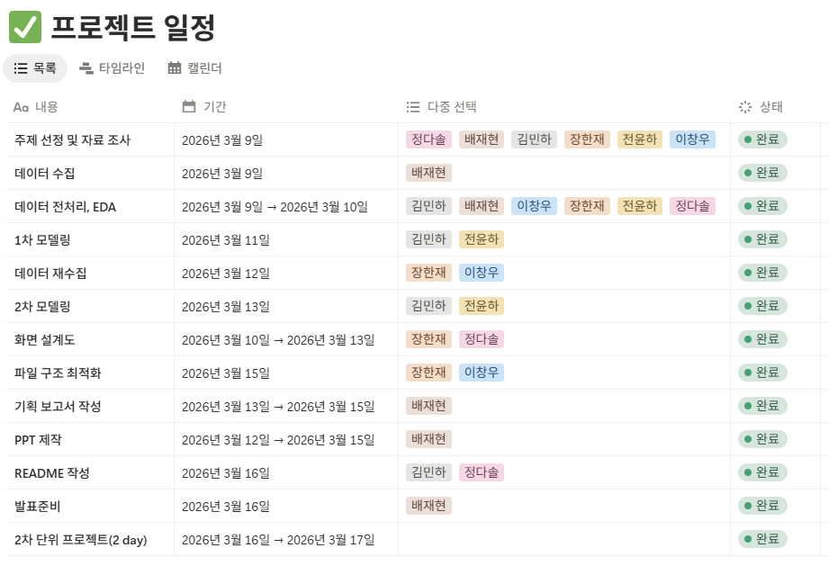
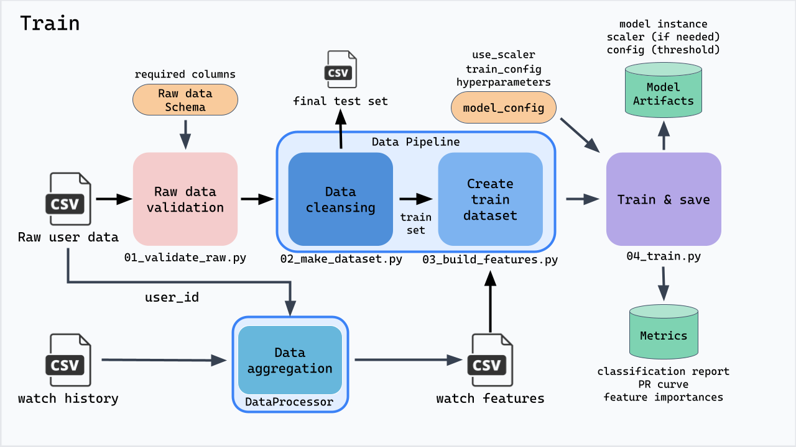
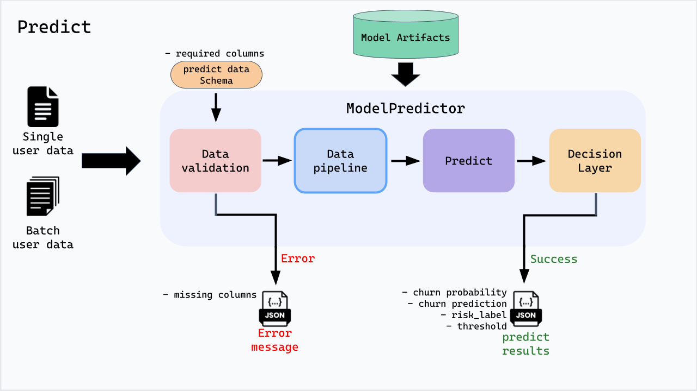
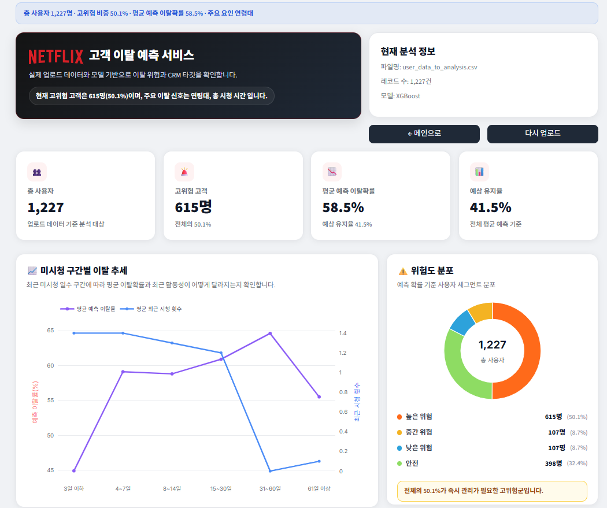

# 🎬 튈까말까 — OTT 고객 이탈 예측

>  Netflix 사용자 행동 데이터를 기반으로 OTT 서비스 고객 이탈을 예측하는 머신러닝 프로젝트

---

## 📌 프로젝트 개요

OTT 서비스 시장의 경쟁이 심화되면서 신규 고객 확보보다 **기존 고객 유지**가 더 중요한 과제로 부상하고 있습니다. 일반적으로 신규 고객 확보 비용은 기존 고객 유지 비용보다 평균 5배 이상 높은 것으로 알려져 있습니다.

본 프로젝트는 **Push-Pull-Mooring(PPM) 이론**을 분석 배경으로 삼아 Netflix 사용자 데이터를 분석하고, 이탈 가능성이 높은 고객을 사전에 식별하는 머신러닝 기반 예측 모델을 구축합니다. 구축된 모델은 Streamlit 대시보드로 시각화하여 CRM 실무에 활용할 수 있도록 설계하였습니다.

> **PPM 모델이란?** 이용자가 서비스를 떠나는 이유를 세 가지로 설명하는 이론입니다. 현재 서비스의 불만족(Push) + 경쟁 서비스의 매력(Pull) + 전환 비용·습관 등 이탈을 억제하는 요소(Mooring)가 복합적으로 작용해 이탈이 발생합니다.

```
1차 데이터(설문) ──┐
                   ├──▶ EDA · 전처리 · 피처 엔지니어링 ──▶ ML 모델링 ──▶ Streamlit 대시보드
2차 데이터(행동) ──┘
```

---

## 👥 팀원

|                                                                  김민하                                                                   |                                                                                      장한재                                                                                      |                                                                 배재현                                                                  |                                                                  전윤하                                                                   |                                                               정다솔                                                                |                                                                                         이창우                                                                                          |
|:--------------------------------------------------------------------------------------------------------------------------------------:|:-----------------------------------------------------------------------------------------------------------------------------------------------------------------------------:|:------------------------------------------------------------------------------------------------------------------------------------:|:--------------------------------------------------------------------------------------------------------------------------------------:|:--------------------------------------------------------------------------------------------------------------------------------:|:------------------------------------------------------------------------------------------------------------------------------------------------------------------------------------:|
|           |                        |  |                           |            |                               |
| [](https://github.com/leedhroxx) |                     [](https://github.com/rusidian)                      | [](https://github.com/rshyun24) | [](https://github.com/yoonha315) | [](https://github.com/soll07) |                         [](https://github.com/Gloveman)                         |
|                                         Logistic Regression 모델링<br/>EDA 수행<br/>회의록 및 README 작성                                         |                                                                    데이터 수집<br/>EDA 수행<br/>Streamlit 대시보드 구현                                                                    |                                            데이터수집 및 전처리<br/>PPT 작성<br/>기획 및 발표<br/>EDA 수행                                             |                                           GitHub 총괄 관리<br/>Random Forest, XGBoost<br/>EDA 수행                                           |                                  Streamlit 구현 및 UI 디자인(Figma)<br/>EDA 수행<br/>README 작성<br/>노션정리                                  |                                                            데이터 수집 및 전처리<br/>feature 생성<br/>train 및 predict 파이프라인 구축 및 모듈화                                                            |

---
## 📄 WBS


<div align="left">  </div>

---

## 🛠️ 기술 스택

| 분류 | 기술                                                                                                                                                                                                                                                                                                   |
|------|------------------------------------------------------------------------------------------------------------------------------------------------------------------------------------------------------------------------------------------------------------------------------------------------------|
| 언어 |                                                                                                                                                                                                 |
| 데이터 처리 |                                                                                               |
| 시각화 |                                                                                |
| 머신러닝 |                                                                                                                                                                              |
| 앱 프레임워크 |                                                                                                                                                                                        |
| 파일 입출력 |  |
| 버전 관리 |                                                                                                                                                                                                  |

---
## 📁 폴더 구조
```
project/
├── 00_data/
│   ├── 00_raw/          # 원본 데이터 (수정 금지)
│   ├── 01_interim/      # 전처리 중간 산출물
│   └── 02_processed/    # 최종 학습/추론용 데이터
│
├── 01_notebooks/        # EDA · 실험용 노트북
│
├── 02_src/
│   ├── 00_common/       # 공통 유틸
│   ├── 01_data/         # 데이터 파이프라인 (전처리 · IO)
│   ├── 02_model/        # 모델 정의 · 학습 · 추론 · 저장
│   └── 03_front/        # Streamlit UI · 서비스 로직
│
├── 03_scripts/          # 파이프라인 실행 엔트리포인트
├── 04_configs/          # 모델 하이퍼파라미터 설정 (JSON)
├── 05_artifacts/        # 학습된 모델 · 전처리기 · 성능 지표
│
├── 09_assets/           # README 이미지, ERD, 파이프라인 다이어그램, 대시보드 스크린샷
│
├── app.py               # Streamlit 앱 진입점
├── requirements.txt
└── README.md
```


---

## 🗂️ 데이터

본 프로젝트는 두 가지 데이터를 단계적으로 활용합니다.

### 1차 데이터 — 한국미디어패널 (2023·2024)

이용자의 디지털 역량, 기술 인식, OTT 이용 행태 등 **설문 기반 개인 특성** 데이터입니다.

| 변수명 | 설명 | 유형 |
|--------|------|------|
| `use_infinite_data_plan` | 무제한 데이터 요금제 사용 여부 | 사용자 환경 |
| `pc_ability` / `internet_ability` | PC·인터넷 활용 능력 | 디지털 역량 |
| `mobile_skills` / `mobile_transaction_skills` | 모바일 활용·거래 능력 | 디지털 역량 |
| `privacy` / `newtech_perception` | 개인정보 보호 인식, 신기술 인식 | 기술 인식 |
| `ott_usage_weekday` / `ott_usage_weekend` | 평일·주말 OTT 이용 시간 | OTT 이용 행동 |
| `age_group` | 연령대 | 사용자 특성 |
| `is_churned` | OTT 서비스 이탈 여부 **(타겟 변수)** | 종속 변수 |

### 2차 데이터 — Netflix 사용자 행동 데이터 (약 21만 건+)

실제 서비스 이용 행동 로그 기반의 **행동 데이터**입니다. 최종 모델 학습 및 서비스에 활용됩니다.

| 파일 | 설명                   | 주요 컬럼                                                                                |
|------|----------------------|--------------------------------------------------------------------------------------|
| `netflix_users.csv` | 사용자 기본 정보            | `user_id`, `age`, `plan_tier`, `monthly_spend`, `is_active`                          |
| `netflix_watch_history.csv` | 시청 이력 로그             | `user_id`, `movie_id`, `watch_date`, `watch_duration_minutes`, `progress_percentage` |
| `user_data_to_analysis.csv` | streamlit 테스트 데이터 | 'is_active'를 제외한 사용자 기본 정보                                                           |

[//]: # (> ⚠️ 원본 데이터&#40;`00_data/00_raw/`&#41;는 수정 금지. 전처리 산출물은 `01_interim/`, 최종 학습 데이터는 `02_processed/`에 저장됩니다.)

---

## 🔍 EDA 주요 인사이트

- **이탈률 불균형**: 전체 데이터에서 이탈 고객(is_churned=1) 비율이 낮아 불균형 처리(class_weight, scale_pos_weight) 전략을 적용
- **최근 미시청 일수**: `days_since_last_watch`가 높을수록 이탈 확률이 유의미하게 증가 — Feature Importance 상위 변수로 확인
- **구독 유지 기간**: `subscription_tenure_days`가 짧은 초기 구독자일수록 이탈률이 높게 나타남
- **요금제 등급**: 저가 요금제(`plan_tier`) 사용자에서 이탈 경향이 상대적으로 강함
- **완주율 & 시청 시간**: `completion_rate`이 낮고 `total_watch_time`이 적은 사용자는 이탈 가능성이 높음 — 2차 데이터 XGBoost 기준 최상위 중요 피처로 확인
- **디지털 역량**: 1차 데이터 분석에서는 모바일 기기 활용 능력, 정보 평가 능력, 개인정보 인식 수준이 이탈과 연관됨

---
## ⚙️ 피처 엔지니어링

시청 이력 로그를 사용자 단위로 집계하여 아래 16개 피처를 생성합니다.

| 피처명 | 설명 |
|--------|------|
| `age` | 연령 |
| `plan_tier` | 요금제 등급 |
| `monthly_spend` | 월 지출액 |
| `age_group` | 연령대 (10단위 구간화) |
| `subscription_tenure_days` | 구독 유지 기간 (일) — 가입일로부터 직접 계산한 파생변수 |
| `watch_count` | 총 시청 횟수 |
| `unique_movies` | 시청한 고유 콘텐츠 수 (다양성) |
| `total_watch_time` | 총 시청 시간 (분) ⭐ |
| `avg_watch_time` | 평균 시청 시간 (분) |
| `watch_days` | 총 시청 일수 ⭐ |
| `recent_watch_count` | 최근 31일 시청 횟수 |
| `days_since_last_watch` | 마지막 시청 후 경과 일수 ⭐ |
| `avg_progress` | 평균 시청 진행률 (%) |
| `completion_rate` | 완주율 (90% 이상 시청 비율) |
| `download_ratio` | 다운로드 비율 |
| `avg_rating` | 평균 평점 |

> ⭐ XGBoost Feature Importance 분석 기준 상위 영향 변수

---

## 🤖 모델링

### 분석 전략

**1차 데이터(설문)** → 모델 구조 탐색 및 설문 변수의 예측 가능성 검증  
**2차 데이터(행동)** → 예측 성능 고도화 및 실제 서비스 적용 모델 구축

이탈 예측 특성상 **놓친 이탈자(FN)의 비용이 크기 때문에** Recall과 PR-AUC를 핵심 지표로 설정했습니다.

### 사용 모델

| 모델 | 스케일링 | 클래스 불균형 처리 | 비고 |
|------|----------|-------------------|------|
| Logistic Regression | ✅ StandardScaler | `class_weight=balanced` | 베이스라인 |
| Random Forest | ❌ | `class_weight=balanced_subsample` | 앙상블 |
| **XGBoost** | ❌ | `scale_pos_weight=2.645` | **최종 선택 모델** |

### 학습 설정 (공통)

- 교차 검증: `StratifiedKFold (k=5)` — 클래스 비율 유지하며 안정적 평가
- 데이터 분할: `train 80% / test 20%`, stratify 적용
- 평가 지표: `Precision`, `Recall`, `F1`, `ROC-AUC`, `PR-AUC`
- 최적 임계값 탐색: F1-score 기준 threshold 탐색 (0.1 ~ 0.9)

### 모델 학습 파이프라인
[Script 상세 실행 가이드](./03_scripts/README.md)
<div align="left">  </div>

### 모델 추론 파이프라인
<div align="left">  </div>
---

### 📊 모델 성능 비교

#### 1차 데이터 결과 (설문 기반)

| 모델 | Precision | Recall | F1 | ROC-AUC | PR-AUC |
|------|-----------|--------|----|---------|--------|
| Logistic Regression | 0.484 | 0.164 | 0.245 | 0.603 | 0.455 |
| Random Forest | 0.476 | 0.557 | 0.513 | 0.648 | 0.524 |
| XGBoost | 0.473 | 0.715 | 0.540 | 0.648 | 0.548 |

> 설문 기반 변수만으로는 실제 이탈 행동 예측에 한계가 있음을 확인 → 2차 데이터 분석으로 이어짐

#### 2차 데이터 결과 (행동 기반) — 최종 모델

| 모델 | Precision | Recall | F1 | ROC-AUC | PR-AUC |
|------|-----------|--------|----|---------|--------|
| Logistic Regression | 0.796 | 0.879 | 0.835 | 0.925 | 0.877 |
| Random Forest | 0.867 | 0.883 | 0.875 | 0.912 | 0.939 |
| **XGBoost** | **0.893** | **0.880** | **0.887** | **0.922** | **0.945** |

> XGBoost가 Precision·Recall·F1 모두 최고 수준. PR-AUC 0.945로 이탈 고객 탐지 능력 검증 완료

---

### 하이퍼파라미터 설정

#### Logistic Regression

| 파라미터 | 값 | 설명 |
|----------|----|------|
| `C` | 0.01 | 규제 강도 (작을수록 강한 규제) |
| `penalty` | l2 | Ridge 규제 적용 |
| `solver` | liblinear | 이진 분류에 적합한 알고리즘 |
| `class_weight` | balanced | 클래스 불균형 보정 |

#### Random Forest

| 파라미터 | 값 | 설명 |
|----------|----|------|
| `n_estimators` | 500 | 생성할 결정 트리 수 |
| `max_depth` | 5 | 트리 최대 깊이 |
| `min_samples_split` | 10 | 노드 분할 최소 샘플 수 |
| `max_features` | None | 분할 시 전체 변수 사용 |
| `class_weight` | balanced | 클래스 불균형 보정 |

#### XGBoost

| 파라미터 | 값 | 설명 |
|----------|----|------|
| `n_estimators` | 500 | 생성할 트리 수 |
| `max_depth` | 3 | 트리 최대 깊이 |
| `learning_rate` | 0.03 | 학습률 (낮을수록 꼼꼼하게 학습) |
| `subsample` | 0.7 | 트리 학습 시 데이터 샘플 비율 |
| `colsample_bytree` | 0.7 | 트리 학습 시 피처 사용 비율 |
| `min_child_weight` | 3 | 리프 노드 최소 가중치 합 |
| `gamma` | 0 | 노드 분할 최소 손실 감소값 |
| `scale_pos_weight` | 2.645 | 이탈/비이탈 클래스 불균형 보정 가중치 |

---

## 🖥️ Streamlit 앱

분석 결과 가장 높은 성능을 보인 **2차 데이터 기반 XGBoost 모델**을 적용한 웹 대시보드입니다.

> 📸 **스크린샷 / GIF**  


<div align="left">  </div>


### 주요 기능

- **홈 화면**: CSV 파일 업로드 및 전체 고객 현황 확인 (고객 수, 이탈 위험 비율, 이용 패턴)
- **대시보드**: 개별 고객 이탈 확률 예측 + 위험군 자동 분류 (위험군 / 잠재 위험군 / 유지군)
- **시각화**: Feature Importance, PR-Curve 차트 제공
- 배치 CSV 업로드 방식으로 대규모 고객 데이터 일괄 처리 지원

---

## ⚠️ 한계점 및 향후 개선 방향

### 현재 한계점

- **단일 플랫폼 데이터**: Netflix 데이터만 활용하여 Disney+, 티빙, 웨이브 등 전체 OTT 시장으로 일반화하는 데 제약이 있음
- **행동 변수 다양성 부족**: 콘텐츠 장르 선호도, 추천 시스템 반응, UI 이용 패턴 등 추가 행동 데이터 미반영
- **정적 배치 방식**: 실시간 스트리밍 없이 CSV 업로드 방식으로만 추론 가능
- **모델 범위**: 머신러닝 3종 비교에 그치며, 딥러닝·하이브리드 앙상블 등 추가 실험 미수행
- **설명 가능성**: 피처 중요도 수준의 해석만 제공, 개인별 예측 근거 설명 미구현

### 향후 발전 방향

- [ ] **다양한 OTT 플랫폼 데이터 통합** 분석으로 일반화 가능성 확대
- [ ] **딥러닝 모델 실험** (Deep Learning, Easy Ensemble, Stacking Ensemble 비교 연구)
- [ ] **콘텐츠 장르 선호도, 추천 반응 데이터** 등 행동 변수 확장

---
## 프로젝트 팀원 회고

본 프로젝트 수행 과정에서 팀원 간 협업 경험과 기여도를 상호 평가하기 위해 회고를 기록한다.  
평가 내용은 자유롭게 작성하며, 프로젝트 기여·협업·문제해결·리더십 등을 중심으로 기술한다.

---

### 김민하 회고

<table>
  <tr>
    <th align="center" width="90">평가자</th>
    <th align="center">회고 내용</th>
  </tr>
  <tr>
    <td align="center"><nobr>배재현</nobr></td>
    <td>Logistic Regression 모델링과 EDA를 수행하며 프로젝트 분석의 기초를 안정적으로 구축하였다. 회의록 작성과 README 정리를 통해 팀 내 정보 공유와 작업 흐름을 체계적으로 관리하는 데 기여하였으며, 꾸준하고 성실한 태도로 프로젝트 전반이 원활하게 진행될 수 있도록 든든한 기반을 다지는 역할을 수행하였다.</td>
  </tr>
  <tr>
    <td align="center"><nobr>이창우</nobr></td>
    <td>회의가 있을때마다 회의록을 잘 정리해주시고, EDA 결과 등 제가 잘 신경쓰지 못했던 notion 및 문서 관리 부분을 잘 맡아주셨습니다. 또한 윤하님의 모델 구축 과정에 맞추어 LogisticRegression 모델 구축을 해 주셔서 모델 파이프라인 구축에 도움이 되었습니다.</td>
  </tr>
  <tr>
    <td align="center"><nobr>장한재</nobr></td>
    <td>프로젝트에서 EDA와 Logistic Regression 모델링을 함께 맡아 데이터의 흐름을 이해하고 기본 성능을 확인하는 데 큰 기여를 해주셨습니다. 또한 회의록도 함께 담당해주셔서 팀의 진행 상황과 결과를 체계적으로 정리할 수 있었고, 덕분에 프로젝트 전반의 흐름을 보다 명확하게 파악할 수 있었습니다.</td>
  </tr>
  <tr>
    <td align="center"><nobr>전윤하</nobr></td>
    <td>모델링 업무를 성실하게 수행하며 프로젝트의 기술적 완성도를 높이는 데 기여했습니다.</td>
  </tr>
  <tr>
    <td align="center"><nobr>정다솔</nobr></td>
    <td>모델링을 맡아 베이스라인 모델의 기준을 잡아주셨고, EDA를 통해 데이터의 주요 패턴을 파악하고, 회의록과 README까지 꼼꼼하게 정리해주셔서 팀원들이 확인하기 편하게 해주셨습니다. 문서화 작업 덕분에 프로젝트의 흐름이 명확하게 유지될 수 있었습니다.</td>
  </tr>
</table>

---

### 배재현 회고

<table>
  <tr>
    <th align="center" width="90">평가자</th>
    <th align="center">회고 내용</th>
  </tr>
  <tr>
    <td align="center"><nobr>김민하</nobr></td>
    <td>
    </td>
  </tr>
  <tr>
    <td align="center"><nobr>이창우</nobr></td>
    <td>1차로 사용한 데이터의 EDA 과정에서 기초 통계 분석에 더해 EFA 분석이라는 전혀 생각하지 못한 도구를 통해 feature를 추출하는 방식을 보여 주셔서 모델 입력 데이터 구축 시에 큰 도움을 받았습니다. 또한 프로젝트의 기획적인 부분을 잘 설정해 주셨고 발표자료 역시 아주 높은 퀄리티로 만들어 주셔서 발표까지 잘 마무리 할 수 있었던 것 같습니다.</td>
  </tr>
  <tr>
    <td align="center"><nobr>장한재</nobr></td>
    <td>데이터 수집 및 전처리뿐만 아니라 PPT 작성, 발표까지 폭넓게 맡아 프로젝트가 체계적으로 정리되고 전달될 수 있도록 해주셨습니다. 특히 발표 자료를 이해하기 쉽게 구성해주셔서 프로젝트 내용을 효과적으로 전달하는 데 큰 역할을 해주셨습니다.</td>
  </tr>
  <tr>
    <td align="center"><nobr>전윤하</nobr></td>
    <td>프로젝트 기획과 발표를 담당하며 회의를 적극적으로 이끌고 팀 내 의견을 효과적으로 조율했습니다.</td>
  </tr>
  <tr>
    <td align="center"><nobr>정다솔</nobr></td>
    <td>데이터 수집과 전처리를 담당하며 분석의 토대를 마련해주셨고, 프로젝트의 기획과 PPT, 발표까지 직접 맡아 프로젝트의 마무리가 잘 될 수 있도록 큰 역할을 해주셨습니다. 복잡한 분석 내용을 이해하기 쉽게 정리하고 전달해주신 덕분에 프로젝트 결과가 더욱 빛날 수 있었습니다.</td>
  </tr>
</table>

---
### 이창우 회고

<table>
  <tr>
    <th align="center" width="90">평가자</th>
    <th align="center">회고 내용</th>
  </tr>
  <tr>
    <td align="center"><nobr>김민하</nobr></td>
    <td>
    </td>
  </tr>
  <tr>
    <td align="center"><nobr>배재현</nobr></td>
    <td>데이터 전처리와 피처 생성, train/predict 파이프라인 구축을 담당하며 프로젝트의 기술적 기반을 탄탄하게 마련하였다. 모델이 실제로 작동할 수 있도록 전체 흐름을 설계하고 안정적으로 구현하였으며, 꼼꼼한 성격을 바탕으로 코드 구조를 체계적으로 정리하여 결과물의 완성도를 높이는 데 핵심적인 역할을 수행하였다.</td>
  </tr>
  <tr>
    <td align="center"><nobr>장한재</nobr></td>
    <td>데이터 수집 및 전처리, feature 생성, train 및 predict 파이프라인 구축과 모듈화까지 맡아 프로젝트의 핵심 기술 구조를 탄탄하게 만들어주셨습니다. 특히 반복적으로 활용할 수 있는 형태로 코드를 구성해주셔서 작업 효율성과 재현성을 높여주셨고, 프로젝트가 안정적으로 구현되는 데 큰 기여를 해주셨습니다.</td>
  </tr>
  <tr>
    <td align="center"><nobr>전윤하</nobr></td>
    <td>맡은 역할을 묵묵히 수행하며 프로젝트가 안정적으로 진행될 수 있도록 기반을 뒷받침했습니다.</td>
  </tr>
  <tr>
    <td align="center"><nobr>정다솔</nobr></td>
    <td>데이터 전처리와 feature 생성, train/predict 파이프라인 구축 및 모듈화까지 기술적인 부분을 전반적으로 담당해주셨습니다. 코드가 체계적으로 정리된 덕분에 팀원 모두가 일관된 방식으로 실험을 진행할 수 있었고, 재현 가능한 분석 환경을 만드는 데 중요한 역할을 해주셨습니다.</td>
  </tr>
</table>

---

### 장한재 회고

<table>
  <tr>
    <th align="center" width="90">평가자</th>
    <th align="center">회고 내용</th>
  </tr>
  <tr>
    <td align="center"><nobr>김민하</nobr></td>
    <td>
    </td>
  </tr>
  <tr>
    <td align="center"><nobr>배재현</nobr></td>
    <td>데이터 수집부터 EDA, Streamlit 대시보드 구현까지 폭넓게 담당하며 프로젝트 결과의 활용도를 크게 높였다. 문제를 적극적으로 해결해나가는 태도와 지속적인 의견 제시를 바탕으로 코드 구조 정리에도 기여하였으며, 실용적인 시각으로 프로젝트 전반의 완성도를 높이는 데 중요한 역할을 수행하였다.</td>
  </tr>
  <tr>
    <td align="center"><nobr>이창우</nobr></td>
    <td>프로젝트 폴더 구조를 상세하게 잡아주셔서 모듈화에 있어 어려움을 덜 수 있었습니다. 또한 front 부분을 맡아 view/state/service 등 streamlit이 아닌 일반 웹 프론트 개발을 하는 것처럼 코드 구조화를 잘 해주셔서 안정성 있는 front app이 만들어질 수 있었던 것 같습니다. 덕분에 data 및 model pipeline에 집중하여 더욱 완성도 높은 코드를 작성할 수 있었던 것 같습니다.</td>
  </tr>
  <tr>
    <td align="center"><nobr>전윤하</nobr></td>
    <td>다양한 의견을 적극적으로 제시하고 어려운 상황에서 팀원들을 지원하며 협업에 기여했습니다.</td>
  </tr>
  <tr>
    <td align="center"><nobr>정다솔</nobr></td>
    <td>다양한 의견을 적극적으로 제시하며 협업 규칙을 체계적으로 정리해주셔서 팀의 방향성을 잡는 데 큰 도움이 되었습니다. 또한 머신러닝 모델 결과를 Streamlit 대시보드로 구현해주셔서, 팀원들이 결과를 직관적으로 확인하고 보다 구체적인 논의를 이어갈 수 있었습니다.</td>
  </tr>
</table>

---

### 전윤하 회고

<table>
  <tr>
    <th align="center" width="90">평가자</th>
    <th align="center">회고 내용</th>
  </tr>
  <tr>
    <td align="center"><nobr>김민하</nobr></td>
    <td>
    </td>
  </tr>
  <tr>
    <td align="center"><nobr>배재현</nobr></td>
    <td>Random Forest와 XGBoost 모델링을 중심으로 성능 개선을 주도하며 지속적인 검증과 반복적인 개선을 통해 프로젝트의 신뢰도를 높이는 데 기여하였다. 성실하고 꾸준한 태도를 바탕으로 분석의 안정성을 확보하였으며, 결과 해석의 완성도를 높이는 데 중요한 역할을 수행하였다.</td>
  </tr>
  <tr>
    <td align="center"><nobr>이창우</nobr></td>
    <td>완성된 모델 학습 데이터셋을 통해 RandomForest와 XGBoost 모델 구축을 맡으셨습니다. 학습 과정과 모델별 하이퍼파라미터 최적화, threshold tuning 및 성능 시각화까지의 과정을 일관되게 정리해 주셔서 모델 파이프라인 구축을 훨씬 편하게 할 수 있었습니다.</td>
  </tr>
  <tr>
    <td align="center"><nobr>장한재</nobr></td>
    <td>Random Forest, XGBoost 모델링을 담당해 다양한 모델을 비교하고 성능을 높이는 데 기여해주셨습니다. 또한 GitHub 총괄 관리까지 맡아 협업 과정에서 자료와 코드를 체계적으로 정리해주셔서 팀원들이 보다 원활하게 작업할 수 있었고, 프로젝트의 기술적 완성도를 높이는 데 중요한 역할을 해주셨습니다.</td>
  </tr>
  <tr>
    <td align="center"><nobr>정다솔</nobr></td>
    <td>GitHub 총괄 관리를 맡아 팀원들이 충돌 없이 협업할 수 있는 환경을 만들어주셨습니다. Random Forest와 XGBoost 모델링을 통해 핵심 예측 성능을 끌어올리는 데 크게 기여해주셨으며, 버전 관리가 체계적으로 이루어져 프로젝트 전반이 안정적으로 진행될 수 있었습니다.</td>
  </tr>
</table>

---

### 정다솔 회고

<table>
  <tr>
    <th align="center" width="90">평가자</th>
    <th align="center">회고 내용</th>
  </tr>
  <tr>
    <td align="center"><nobr>김민하</nobr></td>
    <td>
    </td>
  </tr>
  <tr>
    <td align="center"><nobr>배재현</nobr></td>
    <td>EDA와 README 작성, 노션 정리를 주도적으로 담당하며 프로젝트 전반의 결과물을 체계적으로 구조화하는 데 핵심적인 역할을 수행하였다. 높은 책임감과 뛰어난 집중력을 바탕으로 프로젝트 진행 과정에서 미흡한 부분을 적극적으로 보완하였으며, Streamlit 구현과 UI 설계를 통해 사용자 관점에서 결과를 명확하게 전달하는 데 실질적인 기여를 하였다.</td>
  </tr>
  <tr>
    <td align="center"><nobr>이창우</nobr></td>
    <td>figma를 통해 streamlit page의 디자인을 맡아주시고, page 기능 구현에 도움을 주셨습니다. 또한 README 내용을 깔끔하게 정리해 주셔서 기술적인 내용의 정리에 집중할 수 있었습니다.</td>
  </tr>
  <tr>
    <td align="center"><nobr>장한재</nobr></td>
    <td>Streamlit 구현과 UI 디자인을 함께 맡아 프로젝트 결과물이 보다 보기 좋고 사용자 친화적으로 완성될 수 있도록 해주셨습니다. 또한 노션 정리까지 담당해주셔서 분석 과정과 결과를 정리하는 데 많은 도움이 되었고, 팀의 산출물이 깔끔하게 정리될 수 있도록 기여해주셨습니다.</td>
  </tr>
  <tr>
    <td align="center"><nobr>전윤하</nobr></td>
    <td>CRM 디자인을 주도적으로 수행하고 프로젝트 Notion을 구축 및 체계적으로 관리하여 협업 환경을 정비하는 데 기여했습니다.</td>
  </tr>
</table>
